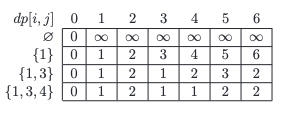

### The Coin Changing problem
- The greedy algorithmic approach is always to select the largest denomination not exceeding the remaining amount of money to be paid. 
- However, this algorithm may return a suboptimal result. For instance, for an amount of 6 and coins of values 1, 3, 4, we get 6 = 4 + 1 + 1, but the optimal solution here is 6 = 3 + 3.
- A dynamic algorithm finds solutions to this problem for all amounts not exceeding the given amount, and for increasing sets of denominations. 
---
- For the example data, it would consider all the amounts from 0 to 6, and the following sets of denominations: ∅, {1}, {1, 3} and {1, 3, 4}. 
- Let dp[i, j] be the minimum number of coins needed to pay the amount j if we use the set containing the i smallest denominations. 
- The following table shows all the solutions to sub-problems considered for the example data.



### Implementation
The dynamic algorithm for finding change.
```python
def dynamic_coin_changing(C, k):
	n = len(C)
	# create two-dimensional array with all zeros
	dp = [[0] * (k + 1) for i in xrange(n + 1)]
	dp[0] = [0] + [MAX_INT] * k
	for i in xrange(1, n + 1):
		for j in xrange(C[i - 1]):
			dp[i][j] = dp[i - 1][j]
		for j in xrange(C[i - 1], k + 1):
			dp[i][j] = min(dp[i][j - C[i - 1]] + 1, dp[i - 1][j])
	return dp[n]
```

The dynamic algorithm for finding change with optimized memory.
```python
def dynamic_coin_changing(C, k):
	n = len(C)
	dp = [0] + [MAX_INT] * k
	for i in xrange(1, n + 1):
		for j in xrange(C[i - 1], k + 1):
			dp[j] = min(dp[j - C[i - 1]] + 1, dp[j])
	return dp
```
- The time complexity is O(n · k) and the space complexity is O(k).