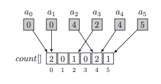

### count array
- a0, a1, . . . , an−1 are usually put into the corresponding consecutive indices of the array:
A[0] = a0 A[1] = a1 . . . A[n − 1] = an−1

- The limitation here may be available memory. Usually, we are not able to create arrays of 10^9 integers, because this would require more than one gigabyte of available memory.

### negative integers
- Counting the number of negative integers can be done in two ways.
1. to add some big number to each value
2. we simply create a second array for counting negative numbers

### where to use? (exercise)
- The goal is to check whether there is a swap operation which can be performed on these arrays in such a way that the sum of elements in array A equals the sum of elements in array B after the swap. By swap operation we mean picking one element from array A and one element from array B and exchanging them.

1. solution O(n^2): The simplest method is to swap every pair of elements and calculate the totals.
2. Solution O(n + m): The best approach is to count the elements of array A and calculate the difference d between the sums of the elements of array A and B.