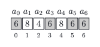
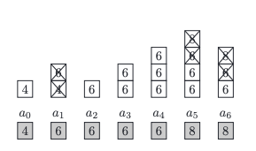

- In the picture the leader is highlighted in gray. Notice that the sequence can have at most one leader.
- The leader may be found in many ways. We describe some methods here,

Leader — O(n2).
```python
def slowLeader(A):
	n = len(A)
	leader = -1
	for k in xrange(n):
		candidate = A[k]
		count = 0
		for i in xrange(n):
			if (A[i] == candidate):
				count += 1
		if (count > n // 2):
			leader = candidate
	return leader
```

- Notice that if the leader occurs somewhere in our sequence, then it must occur at index n/2 (the central element)
Leader — O(n log n).
```python
def fastLeader(A):
	n = len(A)
	leader = -1
	A.sort()
	candidate = A[n // 2]
	count = 0
	for i in xrange(n):
		if (A[i] == candidate):
			count += 1
	if (count > n // 2):
		leader = candidate
	return leader
```


- Let’s create an empty stack onto which we will be pushing consecutive elements. 
- After each such operation we check whether the two elements at the top of the stack are different. 
- If they are, we remove them from the stack. 
- This is equivalent to removing a pair of different elements from the sequence (in the picture below, different elements being removed are highlighted in gray).

Leader — O(n).
```python
def goldenLeader(A):
	n = len(A)
	size = 0
	for k in xrange(n):
		if (size == 0):
			size += 1
			value = A[k]
		else:
			if (value != A[k]):
				size -= 1
			else:
				size += 1
	candidate = -1
	if (size > 0):
		candidate = value
	leader = -1
	count = 0
	for k in xrange(n):
		if (A[k] == candidate):
			count += 1
	if (count > n // 2):
		leader = candidate
	return leader
```